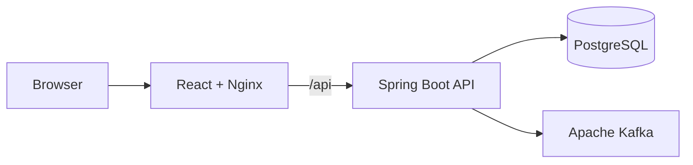

# Northstar CRM Capstone

Northstar CRM is a full-stack customer relationship management application developed as a Java Software Engineer capstone. An authenticated agent can search for a customer, view a customer profile and interaction history, and record a new customer interaction.

The application persists customer and interaction data in PostgreSQL and publishes versioned interaction events through Apache Kafka. It is packaged as backend and frontend container images and deployed to Kubernetes.

## Core Capabilities

- Authenticate synthetic AGENT and ADMIN users with JWT-based security
- Enforce role-based access control on protected API operations
- Search for customers by customer ID or customer information
- Display persisted customer profiles and interaction history
- Record `NOTE`, `CALL`, `EMAIL`, and `MEETING` interactions
- Validate interaction requests and reject unknown customers
- Persist accepted interactions in PostgreSQL
- Publish versioned Kafka events for successful interactions
- Propagate correlation IDs across HTTP, persistence, logs, and events
- Deploy the complete platform through Kubernetes
- Verify backend, frontend, and container changes through GitHub Actions

## Architecture



The frontend is served by an unprivileged Nginx container. Nginx also forwards `/api` requests to the Spring Boot backend service. The backend validates and authorizes requests, persists CRM data through JPA and Flyway-managed PostgreSQL tables, and publishes successful interaction events to Kafka.

## Technology Stack

| Area | Technologies |
|---|---|
| Frontend | React, TypeScript, Vite, Vitest, ESLint, Nginx |
| Backend | Java 21, Spring Boot, Spring Security, Spring Data JPA, Maven |
| Database | PostgreSQL, Flyway |
| Messaging | Apache Kafka in KRaft mode |
| Containers | Docker, multi-stage Dockerfiles, GitHub Container Registry |
| Orchestration | Kubernetes, k3d, training k3s cluster |
| CI/CD | GitHub Actions |
| Testing | JUnit, Spring Boot Test, frontend unit tests, smoke tests |

## Repository Layout

```text
.
├── .github/workflows/               GitHub Actions workflows
├── Frontend/                        React, TypeScript, Vite, and Nginx
├── backend/                         Spring Boot, Flyway, JPA, and Kafka
├── infrastructure/kubernetes/       Kubernetes manifests
├── database/                        Database-related project files
├── docs/                            Architecture and delivery documentation
└── Defense/                         Presentation and defense material
```

## Primary Application Flow

1. An AGENT or ADMIN user authenticates through the login endpoint.
2. The backend validates the synthetic user credentials and returns a signed JWT.
3. The frontend includes the JWT with protected API requests.
4. The user searches for and opens a customer profile.
5. The user records a customer interaction.
6. The backend validates the interaction and verifies that the customer exists.
7. The accepted interaction is persisted in PostgreSQL.
8. A versioned Kafka event is published with the same customer, interaction, and correlation identifiers.

## API Overview

| Operation | Endpoint | Authentication | Successful result |
|---|---|---|---|
| Log in | `POST /api/auth/login` | Public | `200 OK` with JWT and permission |
| Health check | `GET /actuator/health` | Public | `200 OK` while healthy |
| Search customers | Customer search API | AGENT or ADMIN | Matching customer summaries |
| View customer profile | Customer profile API | AGENT or ADMIN | Persisted customer information |
| Record interaction | `POST /api/v1/interactions` | AGENT or ADMIN | `201 Created` |

The complete HTTP request, response, validation, security, error, and messaging contracts are documented in [docs/api-contracts.md](docs/api-contracts.md).

## Interaction Event Contract

| Property | Value |
|---|---|
| Topic | `crm.customer.interactions.v1` |
| Event type | `CustomerInteractionRecorded` |
| Event version | `1` |
| Record key | `customerId` |
| Ordering guarantee | Events for the same customer use the same key |

A successful interaction event contains the interaction ID, customer ID, interaction type, summary, correlation ID, and event timestamp. Failed or rejected interaction requests do not publish a successful interaction event.

## Security Model

- Passwords are stored as BCrypt hashes.
- Protected requests use bearer JWT authentication.
- Missing or invalid authentication returns `401 Unauthorized`.
- Authenticated users without a required role receive `403 Forbidden`.
- Database credentials and the JWT signing secret are supplied through environment variables or Kubernetes Secrets.
- Kubernetes kubeconfig files, JWTs, passwords, and real customer information must not be committed or included in evidence.
- All customer and account information included in the project is synthetic.

## Data Integrity

Flyway manages the PostgreSQL schema and seed data. Database constraints protect the application from invalid state, including:

- Unique customer email addresses
- Supported customer account statuses
- Supported interaction types
- Required interaction fields
- Foreign-key references from interactions to existing customers
- Restricted deletion when dependent interaction records exist

Schema changes are versioned and applied consistently when the backend starts against a new database.

## Reliability and Observability

- Kubernetes startup, readiness, and liveness probes monitor application health.
- PostgreSQL and Kafka use persistent-volume claims in Kubernetes.
- Correlation IDs connect API requests, application logs, PostgreSQL records, and Kafka events.
- Kafka records use `customerId` as the key to preserve per-customer ordering.
- Kubernetes rollout history supports release verification and rollback.
- Backend and frontend workloads run as non-root containers with restricted security contexts.

## CI/CD and Container Images

GitHub Actions verifies changes through:

- Backend Maven tests and verification
- Frontend dependency installation
- Frontend linting
- Frontend unit tests
- Frontend production build
- Backend and frontend container builds

Integrated releases publish backend and frontend images to GitHub Container Registry. Images are tagged with the Git commit SHA for traceability and may also receive the `latest` convenience tag. Kubernetes deployments can reference a tested SHA or immutable digest when demonstrating an identifiable release and rollback.

Published packages:

- `ghcr.io/cmac1031/capstone-project-backend`
- `ghcr.io/cmac1031/capstone-project-frontend`

## Deployment Model

Northstar CRM supports two capstone environments:

| Environment | Purpose |
|---|---|
| Local k3d | Development, integration testing, and local demonstrations |
| SWE2 training k3s | Shared remote Kubernetes demonstration environment |

The Kubernetes deployment contains:

- One PostgreSQL StatefulSet and persistent-volume claim
- One Kafka StatefulSet and persistent-volume claim
- One Spring Boot backend Deployment
- One React/Nginx frontend Deployment
- ClusterIP Services for internal communication
- Kubernetes Secrets for runtime credentials

In the shared training cluster, each student deployment is isolated through its assigned namespace and kubeconfig permissions.

## Synthetic Demo Accounts

| Username | Password | Role |
|---|---|---|
| `agent1` | `password123` | `AGENT` |
| `admin1` | `password123` | `ADMIN` |

These credentials are only for the synthetic capstone environments and must not be reused in a production system.

## Synthetic Demo Customers

| Customer ID | Name | Status |
|---|---|---|
| `CUS-1001` | Amina Khan | ACTIVE |
| `CUS-1002` | Ravi Singh | Seeded demonstration status |

The primary successful interaction demonstration uses:

```text
Customer ID: CUS-1001
Correlation ID: lab-request-001
```

The unknown-customer failure demonstration uses:

```text
Customer ID: CUS-9999
```

## Documentation

| Document | Purpose |
|---|---|
| [Context architecture](docs/architecture/context.md) | System users, dependencies, and boundaries |
| [Container architecture](docs/architecture/container.md) | Application containers and communication paths |
| [Architecture decisions](docs/adrs/) | PostgreSQL, Kafka, consistency, JWT, Kubernetes, React, and Spring decisions |
| [API contracts](docs/api-contracts.md) | HTTP and Kafka request, response, and error contracts |
| [Backlog](docs/backlog.md) | Prioritized capstone stories and acceptance criteria |
| [Non-functional requirements](docs/nfrs.md) | Measurable quality targets and evidence status |
| [Risk register](docs/risk-register.md) | Delivery and demonstration risks |
| [Defense script](Defense/script.md) | Final capstone demonstration sequence |

## Quality Targets

The capstone quality targets include:

- Correct `401`, `403`, `404`, and validation behavior
- A successful `201 Created` interaction workflow
- Matching PostgreSQL and Kafka evidence
- Traceable correlation IDs
- Healthy Kubernetes probes and workloads
- Bound persistent-volume claims
- Green GitHub Actions checks
- Keyboard-accessible critical frontend workflows
- No committed secrets or real customer personally identifiable information

## Out of Scope

- Billing and payment processing
- Real customer personally identifiable information
- Production identity-provider configuration
- Customer deletion
- Multi-region disaster recovery
- Production-scale Kafka clustering
- Production database backup automation
- Features unrelated to the required CRM interaction workflow
