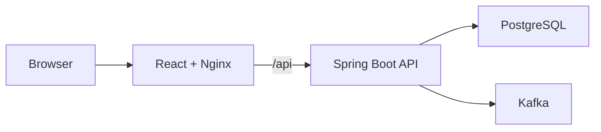

# Northstar CRM Capstone

Northstar CRM is a full-stack customer relationship management application. An authenticated agent can search for a customer, view the customer profile, and record an interaction. The application stores data in PostgreSQL and publishes versioned interaction events through Kafka.

## Architecture


## Repository layout

```text
.
├── Frontend/                         React, TypeScript, Vite, and Nginx
├── backend/                          Spring Boot, Flyway, JPA, and Kafka
├── infrastructure/kubernetes/        Kubernetes manifests
├── database/                         Database-related project files
├── docs/                             Architecture and delivery documentation
└── Defense/                          Presentation and defense material
```

## Prerequisites

Install and start the following tools:

- Git
- Docker Desktop
- kubectl
- k3d

Confirm the tools are available:

```bash
docker --version
kubectl version --client
k3d version
```

## 1. Clone the repository

```bash
git clone https://github.com/CMac1031/Capstone-project.git
cd Capstone-project
```

Use the team-approved branch. For the integrated release, this should normally be `main`:

```bash
git switch main
git pull --ff-only
```
## 2. Create or start the k3d cluster

Create the cluster the first time:

```bash
k3d cluster create northstar --agents 1 --wait
```

If the cluster already exists but is stopped, start it instead:

```bash
k3d cluster start northstar
```

Select and verify the context:

```bash
kubectl config use-context k3d-northstar
kubectl get nodes -o wide
```

Both nodes should report `Ready`.

## 3. Build the application images

Build the Spring Boot backend image from the repository root:

```bash
docker build \
  -t northstar-crm-backend:local \
  backend
```

Build the React/Nginx frontend image:

```bash
docker build \
  -t northstar-crm-frontend:local \
  Frontend
```

Import both local images into k3d:

```bash
k3d image import \
  northstar-crm-backend:local \
  northstar-crm-frontend:local \
  --cluster northstar
```

## 4. Create the namespace and local development secret

Create the namespace:

```bash
kubectl apply \
  -f infrastructure/kubernetes/namespace.yml
```

Create or update the local development secret:

```bash
kubectl -n northstar-crm create secret generic northstar-secrets \
  --from-literal=database-username=northstar \
  --from-literal=database-password=northstar \
  --from-literal=database-name=northstar_crm \
  --from-literal=jwt-secret=local-capstone-development-secret-2026 \
  --dry-run=client -o yaml \
  | kubectl apply -f -
```

These values are for the synthetic local capstone environment only. Never commit real passwords, JWT secrets, `.env` files, kubeconfig files, or real customer data.

Verify the secret keys without displaying their values:

```bash
kubectl -n northstar-crm describe secret northstar-secrets
```

## 5. Deploy PostgreSQL and Kafka

```bash
kubectl apply \
  -f infrastructure/kubernetes/postgres.yml \
  -f infrastructure/kubernetes/kafka.yml
```

Wait for both StatefulSets:

```bash
kubectl -n northstar-crm rollout status \
  statefulset/northstar-postgres \
  --timeout=180s

kubectl -n northstar-crm rollout status \
  statefulset/northstar-kafka \
  --timeout=180s
```

## 6. Deploy the backend and frontend

```bash
kubectl apply \
  -f infrastructure/kubernetes/backend.yml \
  -f infrastructure/kubernetes/frontend.yml
```

Wait for both Deployments:

```bash
kubectl -n northstar-crm rollout status \
  deployment/northstar-backend \
  --timeout=180s

kubectl -n northstar-crm rollout status \
  deployment/northstar-frontend \
  --timeout=180s
```

Verify the complete environment:

```bash
kubectl -n northstar-crm get \
  deployments,pods,services,pvc \
  -o wide
```

The expected application pods are:

- `northstar-postgres-0`
- `northstar-kafka-0`
- One `northstar-backend-*` pod
- One `northstar-frontend-*` pod

Every pod should be `Running` and ready.

## 7. Open the application

Forward a local port to the frontend Service:

```bash
kubectl -n northstar-crm port-forward \
  service/frontend 18081:8080
```

Leave that terminal running and open:

```text
http://localhost:18081
```

The frontend Nginx container proxies `/api/*` requests to the backend Kubernetes Service. A separate backend port-forward is not required.

## Demo accounts

All accounts and customers are synthetic test data.

| Username | Password | Role |
|---|---|---|
| `agent1` | `password123` | `AGENT` |
| `admin1` | `password123` | `ADMIN` |

Demo customers:

- `CUS-1001` - Amina Khan
- `CUS-1002` - Ravi Singh
